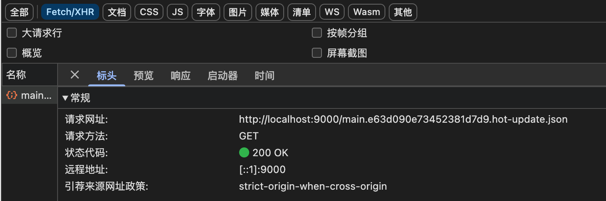
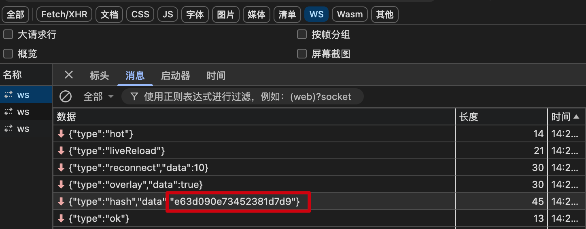

# HMR 热模块替换

HMR 是 Webpack 提供的一种机制，允许在运行时替换模块，而无需整页刷新，从而保持应用状态，提升开发效率和响应速度。

Webpack 的 HMR 是通过 webpack-dev-server 实现的，它启动一个本地服务，包含 HTTP 服务（用于访问页面资源）和 WebSocket 服务（用于推送模块更新）。当我修改源代码时，Webpack 会**增量编译**变更模块，并通过 WebSocket 向浏览器推送更新消息。浏览器接收到通知后，通过内置的 HMR runtime 拉取新的模块代码，并执行 `module.hot.accept` 中的替换逻辑，从而无需刷新页面完成模块替换，提升开发效率。

当修改项目某个文件后，HMR 的工作流程：

1. 文件监听：Webpack 使用 `chokidar` 等库监听源码文件，当发现某个文件发生变更时，触发增量编译。

2. 模块重新编译：Webpack 构建变更模块。生成一个新的模块文件（如 main.abc123.hot-update.js），一个描述更新内容的 JSON 文件（如 main.abc123.hot-update.json）

3. 通知浏览器：Webpack-dev-server 通过 WebSocket 向浏览器推送更新通知，包含更新的 hash、模块 ID 等信息。

4. 客户端处理：浏览器中运行着 Webpack 的 HMR runtime，接收到 WebSocket 通知后，发起请求拉取新的模块代码，执行 module.hot.accept() 中的逻辑，将新模块热替换到页面中

