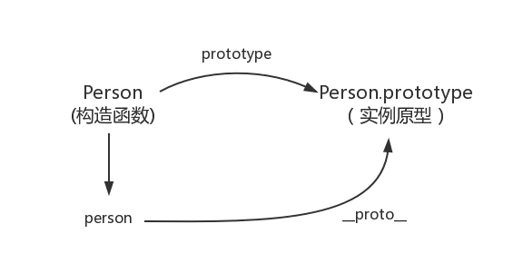
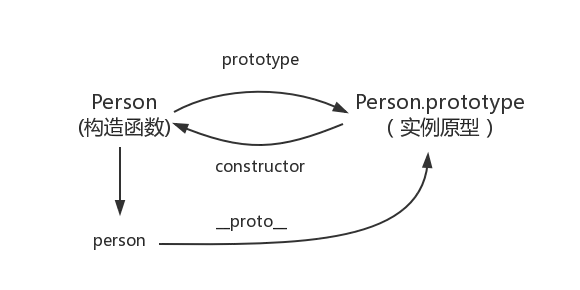
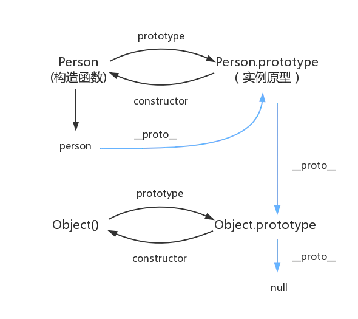

# 原型、原型链

## 原型 prototype

在 JavaScript 中，每当创建一个**函数**时，JavaScript 引擎都会为该函数自动创建一个 `Prototype` 属性，这个属性指向一个对象，这个对象被称为**原型对象**。

```js
function Person(name) {
  this.name = name;
}

console.log(Person.prototype); // { constructor: ƒ }
```

原型对象用于存放**实例对象共享的属性和方法**。所有通过构造函数 `Person` 创建的实例对象都会集成 `Person.prototype` 上的属性和方法。

```js
function Person(name) {
  this.name = name;
}

Person.prototype.sayHello = function () {
  console.log(`Hello, I'm ${this.name}`);
};

const p1 = new Person('Alice');
p1.sayHello(); // Hello, I'm Alice
```

## 实例对象的隐式原型 __proto__

每个对象都有一个内部属性 `[[Prototype]]`，可以通过 `__proto__` 访问，但建议使用 `Object.getPrototypeOf()` 来访问原型

```js
console.log(p1.__proto__ === Person.prototype); // true
console.log(Person.__proto__ === Function.prototype); // true
```



##  constructor

`constructor` 是原型对象上的默认属性，指向创建该原型对象的构造函数。

```js
function Person(name) {
  this.name = name;
}

console.log(Person.prototype.constructor === Person); // true
```




## 原型链

原型链解决了继承问题。

原型链是指一个对象的 `__proto__` 指向其构造函数的 `prototype`，而该 `prototype` 本身也是一个对象，也有自己的 `__proto__` 属性。这样一层层向上查找的链条就是原型链。

```js
console.log(p1.__proto__); // Person.prototype
console.log(p1.__proto__.__proto__); // Object.prototype
console.log(p1.__proto__.__proto__.__proto__); // null
```




当访问对象的属性或方法时，JavaScript 会按以下顺序查找：

1. 实例自身是否有该属性
2. 没有则查找其 `__proto__`（即构造函数的 `prototype`）
3. 再往上查找 `Object.protytype`
4. 找不到则返回 `undefined`