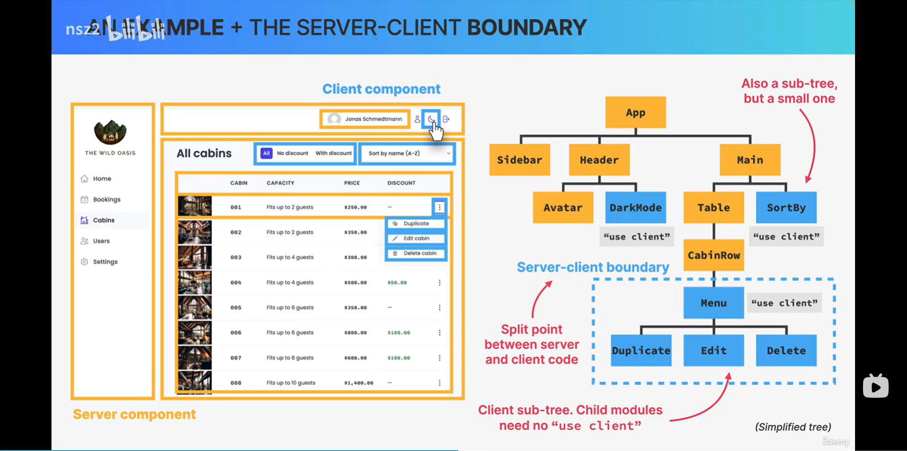
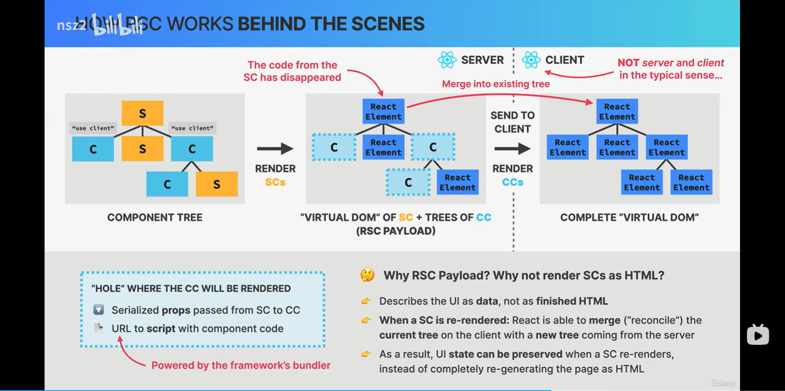
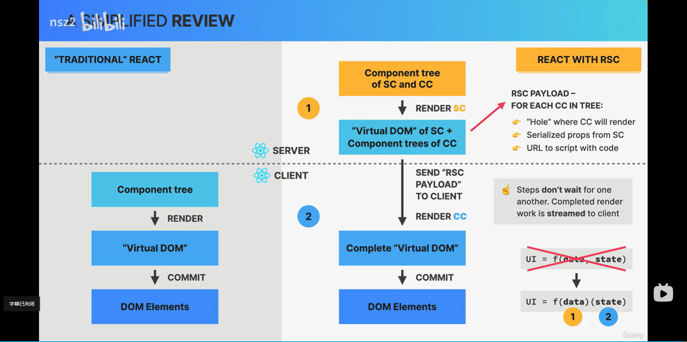

# Next.js

## 客户端渲染（CSR）VS 服务端渲染（SSR）

### 客户端渲染（Client-Side Rendering, CSR）

- HTML 在客户端（用户的浏览器）通过 JavaScript 渲染。
- 适用于高度交互的单页应用（SPA）。
- 典型代表：React、Vue 等前端框架。

### 服务端渲染（Server-Side Rendering, SSR）

- HTML 在服务端（开发者的服务器）渲染后返回给客户端。
- 适用于内容驱动、对 SEO 有较高要求的网站。
- 典型代表：Next.js、Nuxt.js 等框架。

### 优缺点对比

| 🔍 特性           | 🖥️ 客户端渲染（CSR）                              | 🧭 服务端渲染（SSR）                         |
|------------------|---------------------------------------------------|---------------------------------------------|
| 渲染位置       | 浏览器端执行渲染                                | 服务端生成完整 HTML 响应                     |
| 初始加载速度   | ⛔ 较慢：需下载大量 JS，挂载后再请求数据         | ✅ 较快：HTML + 数据一次性返回               |
| 交互性         | ✅ 高：JS 全加载，响应更快                        | ⚠️ 一定延迟：可能需刷新页面                  |
| SEO 支持       | ⚠️ 不友好：搜索引擎难抓取 JS 动态内容           | ✅ 友好：内容直接返回，利于收录              |
| 典型使用场景   | ✅ 内部管理工具、登录后系统、单页应用（SPA）     | ✅ 博客、新闻、电商、需要 SEO 的页面          |

> 📌 **注意**：CSR 更注重交互体验，适用于功能性强、用户登录后的应用；SSR 更注重首屏加载和 SEO，适合内容展示型网站。


## 水合（Hydration）

水合（Hydration）是服务端渲染（SSR）与客户端渲染结合时的一个重要机制。它指的是：浏览器端的 React 应用接管（激活）服务端渲染出来的静态 HTML，使其变为可交互的 React 组件。

其原理是，服务端先将 React 组件渲染为 HTML 字符串，返回给浏览器。浏览器加载页面后，前端 JavaScript 代码会用 React 的 hydrate 或 hydrateRoot 方法，将 React 组件"挂载"到已有的 HTML 上。React 会复用已有的 DOM 节点，只为需要交互的部分添加事件监听等，从而避免了客户端重新渲染整个页面，提高了性能。

例如：

```js
// 服务端渲染
const html = renderToString(<App />)
// 客户端水合
ReactDOM.hydrateRoot(document.getElementById("root"), <App />)
```

水合的意义在于，用户首次访问时，看到的是已经渲染好的 HTML，体验更好；而在 JavaScript 加载后，页面上的按钮、表单等交互功能会被激活。水合是连接 SSR 和客户端 React 的桥梁，让页面既快又能交互，是现代 React/Next.js 应用的重要机制。

## Next.js 核心特性

1. 服务端渲染：每个页面可以灵活选中使用**静态生成**或者**服务端渲染**，根据需求动态选择渲染方式，更好地平衡性能与实时性。
2. 基于文件的路由系统：使用**文件夹结构**直接定义路由路径，开发体验更直观。支持特殊文用于构建页面结构和加载逻辑。
3. 服务端数据处理：在服务器组件（Server Components）直接获取数据，无需前端额外请求。通过 **Server Actions** 在服务端处理数据变更，例如表单提交等操作，提升了安全性，简化客户端逻辑。
4. 自动性能优化：Next.js 开箱即用的优化机制包括：
     - 图片优化：自动压缩、懒加载等；
     - 字体优化：减少 CLS，提高视觉体验
     - SEO 支持：更易被搜索引擎抓取
     - 资源预加载：加快页面访问速度

## App Router VS Pages Router

| 特性/对比点 | App Router（现代） | Pages Router（传统） |
|-------------|-------------------|----------------------|
| 发布版本 | Next.js 13.4（2023 年） | Next.js v1（2016 年） |
| 适用建议 | ✅ 推荐用于新项目 | ✅ 仍受支持，未来持续维护 |
| 架构 | 基于 React 全栈架构（Server Components、Server Actions、Streaming 等） | 无全栈架构，仅支持传统页面逻辑 |
| 数据获取方式 | 在组件中直接使用 `fetch()` 获取数据 | 使用 Next.js 特定 API，如 `getStaticProps` 和 `getServerSideProps` |
| 布局支持 | ✅ 非常易于创建布局、加载器等 | ⚠️ 实现布局相对复杂 |
| 路由功能 | ✅ 支持并行路由等高级功能 | 🚫 功能较基础 |
| 开发体验（DX）& 用户体验（UX） | ✅ 更现代、更灵活 | ✅ 简单易懂，上手快 |
| 缓存机制 | ⚠️ 缓存策略激进，可能引起困惑 | 相对简单、易控 |
| 学习曲线 | ⚠️ 较陡峭（但是 React 生态的一部分） | ✅ 更平缓、易学 |


## React Server Component （RSC）

RSC 是一种全新全新的架构模式，允许开发者：
- 在服务器端渲染组件：部分组件只在服务器上运行和渲染；
- 减少客户端压力：服务器组件不会被打包到客户端 bundle 中；
- 自然混合前后端代码：在同一个库中无缝集成前后端逻辑；


在 RSC 架构中，区分组件应该写在 Server Component 还是 Client Component 中主要基于以下规则：

Server Component 适用场景：

1. 数据获取和数据处理：需要直接访问数据库或后端 API，包含敏感逻辑和数据；
2. 静态内容：不包含交互性、状态或效果的纯展示内容，例如：文章内容、产品描述等；
3. 大型依赖：使用尽在服务器可用的 npm 包；
4. 性能优化：希望减少客户端 bundle 大小；

Client Component 适用场景：

1. 交互需求：需要事件处理、状态管理、调用浏览器 API；
2. UI 状态：表单输入、动画、拖拽等效果；
3. 第三方库：依赖客户端功能的库




## Client Component VS Server Component

| 特性                | 客户端组件 (Client Components)           | 服务器组件 (Server Components)       |
|---------------------|------------------------------------------|--------------------------------------|
| **状态/Hooks**      | ✅ 支持 (useState, useEffect 等)         | ❌ 不支持                            |
| **状态提升**        | ⬜ 可选 (Lifting state up)               | ❌ 不适用 (N.A.)                     |
| **Props 传递**      | ✅ 支持                                  | ✅ 支持 (必须可序列化，不能传函数/类) |
| **数据获取**        | ⬜ 可通过库实现 (preferably with library) | ✅ 首选 (直接使用 async/await)        |
| **导入限制**        | 仅能导入客户端组件                       | 可导入客户端和服务器组件              |
| **渲染限制**        | 只能渲染客户端组件                       | 可渲染客户端和服务器组件              |
| **重新渲染触发条件**| 状态变化时                               | URL 变化时 (导航)                    |
| **默认类型**        | ❌ 需要显式声明 "use client"              | ✅ 默认类型                          |

## React Server Component 优缺点

### 优势 

1. 全栈开发能力：仅用 React 组件 + Server actions 即可构建完整全栈应用；前后端共享单一代码库；
2. 数据安全与效率：服务端组件直接访问数据源；页面级数据预获取，避免客户端请求；“代码消失”特性：服务端组件不传输 JS，可零成本引入大型库；
3. 开发体验：更贴近传统 React 开发；

### 劣势

1. 复杂程度增加：显著提高 React 复杂度，需要学习新的概念；需频繁决策组件类型(服务端/客户端)和数据获取位置；
2. 功能限制：上下文 API（Context API）在服务端不可用；必须依赖框架使用
3. 架构决策：增加了"组件类型选择"等新的架构决策点，需要权衡服务端/客户端功能边界；

## React Server Component Works Behind the Scenes




