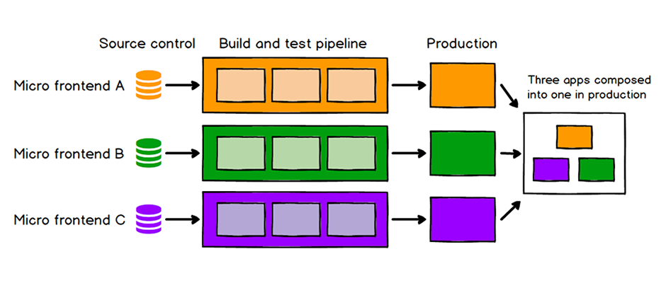

# 微前端

将一个庞大、复杂的前端应用拆分为多个小型、独立、可组合的前端子应用，由不同团队分别开发、部署和运行，最终在用户界面上聚合成一个整体。

它是对微服务架构在前端领域的延申，目的是解决大型前端项目在协作、维护、部署等当面的困难。



## 核心特点

### 子应用自治

- 像微服务一样，每个子应用是一个独立的工程，可以独立开发、测试和部署。
- 子应用可以自己选择适合自己的前端框架（如Vue、React等），只要能与主应用集成即可。

### 统一的集成层（主应用）

- 主应用作为容器，负责加载、卸载和展示各个子应用。
- 子应用可以根据路由或其它机制按需加载。

### 松耦合、强隔离

- 子应用之间尽可能避免相互依赖，可以通过沙箱机制、样式隔离等技术确保互不干扰。

## 微前端问题

- 资源重复加载：多个子应用可能各自加载重复的库，导致体积增大、加载缓慢。
- 首次加载性能差：初次加载时可能需要加载主应用框架 + 子应用框架 + 公共资源，用户等待时间增加。
- 样式冲突：不同子应用的 CSS 如果没有隔离，会造成样式覆盖和污染。
- 全局变量污染：各子应用共享浏览器的全局作用域，如果管理不当可能会发生变量冲突和数据泄露。
- 通信方式不统一：子应用之间需要共享状态或事件通知，处理复杂且易出现依赖耦合。
- 状态同步困难：跨应用共享全局状态（如登录信息）时，可能需要额外工具。

## 解决方案

### iframe（🤦‍♂️不推荐）

`<iframe>`（inline frame）是 HTML 中用于在一个页面嵌入另一个页面的标签。是最原始的“微前端”实现方式。

✅ 优势：

- 强隔离：子应用 JS、CSS、DOM 与主应用完全隔离，互不干扰；
- 跨域支持友好：子应用可以部署在不完全不同的域名下；

❌ 缺点：

1. 通信复杂：主子应用之间需要使用 `postMessage` 实现跨窗口通信，使用麻烦调试困难。
2. 用户体验差：页面刷新、导航不灵活、滚动嵌套容易造成卡顿。
3. 共享状态难：登录态、缓存、Cookie 等无法自动共享，需要额外处理。

主应用与 iframe 子应用的通信方式

```js
// 主应用发送消息给子应用
const iframe = document.querySelector('iframe');
iframe.contentWindow.postMessage({ type: 'LOGIN_SUCCESS', token: 'xxx' }, '*');

// 子应用监听主应用消息
window.addEventListener('message', (event) => {
  if (event.data.type === 'LOGIN_SUCCESS') {
    console.log('收到登录信息', event.data.token);
  }
});
```

### Single-spa

single-spa 将这个前端应用拆分为多个子应用（micro apps），每个子应用都有自己的生命周期，由主应用统一注册和调度。

- 主应用（Root Config）：管理路由、注册子应用、监听地址变化、负责加载/挂载/卸载子应用。
- 子应用（Micro APP）：每个子应用是一个单独的前端项目，导出一套生命周期函数。

✅ 优势：

- 技术栈无关，支持多个框架（React、Vue、Angular 混用）。
- 生命周期完整，灵活控制每个子应用加载与销毁。
- 不依赖特定构建工具，兼容 Webpack/Vite。

❌ 缺点：

- 样式和状态隔离需要手动实现，不提供 Shadow DOM 隔离，需搭配其他方案（如 CSS Module、沙箱）。
- 动态加载依赖，SystemJS	引入额外打包工具或插件以支持 System.import()。
- 调试与构建成本高，多项目联调和打包配置要求较高。

### Qiankun 

`Qiankun` 是阿里基于 `single-spa` 封装的微前端框架，本质上是主应用加载多个子应用，并通沙箱隔离、生命周期管理、资源预加载等机制，把它们整合成一个完整系统。

✅ 优势：

- 技术栈无关，支持多个框架（React、Vue、Angular 混用）。
- 生命周期完整，支持主子应用挂载/卸载/通信全流程。
- 资源预加载，空闲时预加载子应用资源，加快切换速度。
- 沙箱安全，样式和 JS 隔离能力强，不容易互相污染。

❌ 缺点：

- 构建配置略复杂，子应用需配置 public-path 和独立打包逻辑。
- 对 Vite 支持需要兼容处理。
- 部分场景性能偏低，多子应用频繁加载、切换时，可能造成内存或性能问题。

### Module Federation（Webpack 5）

TODO

### Web Components

TODO